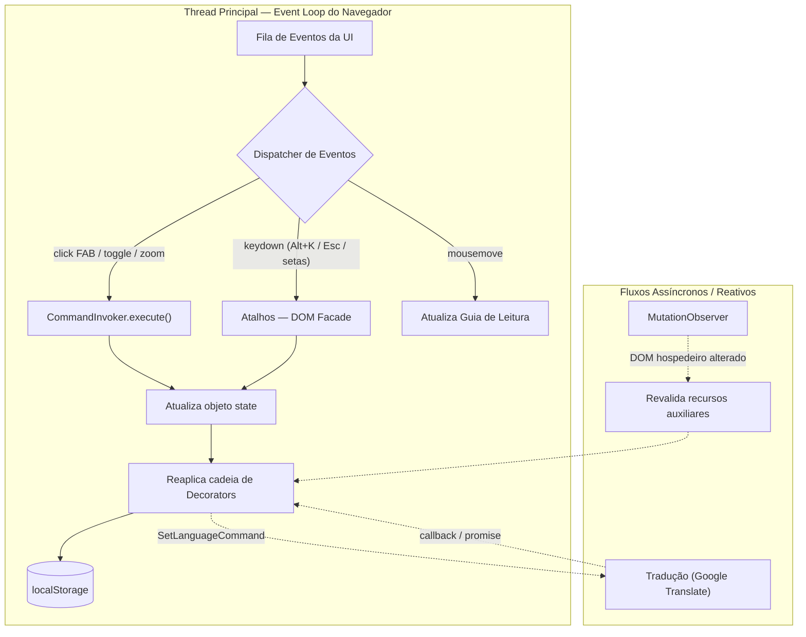
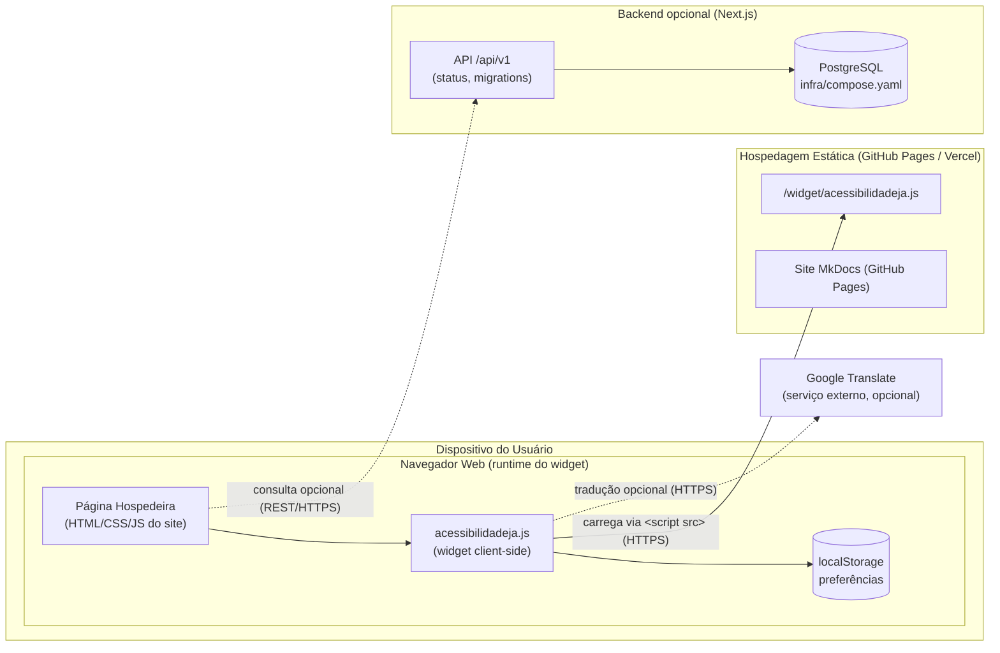
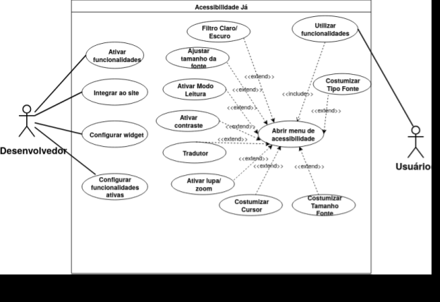
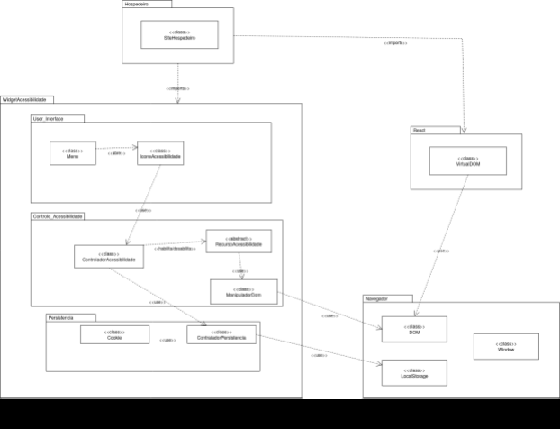
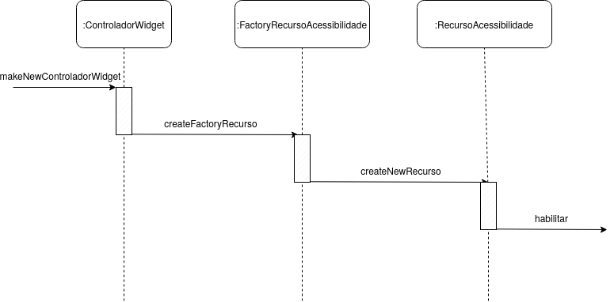

# 4.1. Documento de Arquitetura de Software (DAS)

## Acessibilidade Já - Widget de Acessibilidade Web


## 📋 Sumário Executivo

O **Acessibilidade Já** é um widget de acessibilidade reutilizável, implementado em JavaScript vanilla, projetado para ser facilmente integrado em qualquer site moderno. O sistema foi desenvolvido seguindo princípios de **Reutilização de Software** e demonstra a aplicação prática de **5 padrões de projeto GoF** (Gang of Four):

- **Singleton**: Garante inicialização única do widget
- **Prototype**: Define estrutura base para opções reutilizáveis
- **Factory**: Centraliza criação de ícones e elementos DOM
- **Command**: Encapsula ações permitindo undo/redo
- **Decorator**: Compõe efeitos de acessibilidade dinamicamente

O widget oferece **10 funcionalidades de acessibilidade** distintas, sem dependências externas, com persistência de estado e API pública programática.

---

## 1. Introdução

### 1.1 Propósito

Este documento descreve a arquitetura do widget **Acessibilidade Já**, registrando os principais componentes, decisões arquiteturais, padrões de projeto aplicados e responsabilidades de cada módulo. O propósito é fornecer visão clara da estrutura interna para desenvolvedores que desejam entender, estender ou integrar o widget.

### 1.2 Escopo

O escopo deste DAS contempla:
- ✓ Arquitetura do widget JavaScript standalone
- ✓ Padrões de projeto implementados (GoF)
- ✓ Fluxo de eventos e state management
- ✓ Mecanismo de persistência de preferências
- ✓ Integração com páginas hospedeiras
- ✗ Backend completo (fora do escopo - widget é client-side)
- ✗ Modelagem completa de banco de dados

### 1.3 Visões Arquiteturais

Este documento cobre as **quatro visões do modelo 4+1** de Kruchten, tendo a **Visão de Casos de Uso** (o "+1", os cenários) como elemento integrador:

1. **Visão Lógica** (Seção 2): Componentes internos, responsabilidades e padrões de projeto
2. **Visão de Implementação** (Seção 3): Estrutura de arquivos, módulos e *layers* de código
3. **Visão de Processo** (Seção 4): Modelo de execução em tempo de runtime — *event loop*, fluxos assíncronos e concorrência
4. **Visão de Implantação** (Seção 5): Distribuição física dos artefatos pelos nós de execução (dispositivo, navegador, hospedagem e backend opcional)

O **"+1" — a Visão de Casos de Uso** — atravessa todas as demais e está materializada nos **diagramas UML de apoio** (casos de uso, pacotes e sequência) que ilustram visualmente a arquitetura — ver Seção 6.

---

## 2. Visão Lógica

A visão lógica descreve a decomposição interna do widget em componentes logicamente significativos e seus relacionamentos.

### 2.1 Componentes Principais

#### 🔷 **WidgetSingleton**
- **Responsabilidade**: Garantir inicialização única do widget
- **Mecanismo**: Usa flag global `window.__AcessibilidadeJa__` para evitar duplicatas
- **Padrão**: Singleton
- **Código de Proteção**:
```javascript
var WidgetSingleton = {
  isReady: function () { return !!window.__AcessibilidadeJa__; },
  markReady: function () { window.__AcessibilidadeJa__ = true; },
};
if (WidgetSingleton.isReady()) return;  // Sai se já carregado
```

**Benefício**: Previne duplicação de DOM, vazamento de memória e listeners duplicados

---

#### 🔷 **OptionPrototype**
- **Responsabilidade**: Define estrutura base para opções de acessibilidade
- **Padrão**: Prototype
- **Estrutura Base**:
```javascript
var OptionPrototype = {
  type: 'toggle',      // Tipo de controle
  section: '',         // Categoria (Visualização, Leitura, Navegação)
  key: '',             // ID única (contrast-light, dyslexia, etc)
  icon: '',            // Nome do ícone
  label: '',           // Label para UI
  clone: function(props) {  // Factory method para criar instâncias
    return Object.assign(Object.create(null), this, props || {});
  }
};
```

**Instâncias**: 10 opções criadas via `OptionPrototype.clone({ ... })`

| Key | Seção | Função |
|-----|-------|--------|
| `contrast-light` | Visualização | Contraste claro (fundo branco) |
| `contrast-dark` | Visualização | Contraste escuro (fundo preto) |
| `grayscale` | Visualização | Escala de cinza (sem cores) |
| `highlight-links` | Visualização | Destaca todos os links |
| `reading-mode` | Leitura | Modo de leitura (fundo sépia) |
| `reading-guide` | Leitura | Guia de leitura (linha que segue mouse) |
| `dyslexia` | Leitura | Fonte OpenDyslexic para dislexia |
| `big-cursor` | Navegação | Cursor ampliado |
| `pause-anim` | Navegação | Pausa todas as animações CSS |
| `keyboard-nav` | Navegação | Navegação por teclado (Alt+K) |

---

#### 🔷 **IconFactory**
- **Responsabilidade**: Centralizar criação de ícones SVG
- **Padrão**: Factory
- **Benefício**: Evita duplicação de código SVG; facilita manutenção e substituição de ícones
- **Método**:
```javascript
var IconFactory = {
  _icons: {
    contrast_light: '<svg>...</svg>',
    contrast_dark: '<svg>...</svg>',
    // ... 11 mais
  },
  create: function(name) {
    return this._icons[name] || '';
  }
};
// Uso: var svg = IconFactory.create('contrast_light');
```

---

#### 🔷 **WidgetElementFactory**
- **Responsabilidade**: Criar elementos DOM do widget
- **Padrão**: Factory + Builder
- **Elementos Produzidos**:
  - `createRoot()` - Container principal (#ajw-root)
  - `createFab()` - Botão flutuante de acesso
  - `createPanel()` - Painel lateral com opções
  - `createToggleButton(option)` - Botão toggle individual
  - `createZoomControl()` - Controle de zoom com +/-
  - `createLanguageSelector()` - Seletor de idioma
  - `createReadingExitBar()` - Barra para sair do modo leitura
  - `createGuide()` - Elemento visual da guia de leitura
  - `createSkipLink()` - Link de skip para acessibilidade

**Benefício**: Encapsula detalhes de criação DOM; facilita testes e mudanças estruturais

---

#### 🔷 **Command Pattern - State Management**
- **Responsabilidade**: Encapsular ações do usuário como objetos reutilizáveis
- **Padrão**: Command (GoF Behavioral)
- **Objetivo**: Permitir undo/redo, auditoria e histórico de ações

##### Tipos de Comando:

**ToggleAccessibilityCommand**
```javascript
function ToggleAccessibilityCommand(key, state, root) {
  this.key = key;                          // feature key (contrast-dark, etc)
  this.state = state;                      // estado compartilhado
  this.root = root;                        // elemento DOM raiz
  this.previousValue = state.toggles[key]; // valor anterior (para undo)
}

ToggleAccessibilityCommand.prototype.execute = function() {
  this.state.toggles[this.key] = !this.previousValue;
  this._updateUI();
};

ToggleAccessibilityCommand.prototype.undo = function() {
  this.state.toggles[this.key] = this.previousValue;
  this._updateUI();
};
```

**ZoomCommand** - Ajusta zoom de texto (80-180%)

**SetLanguageCommand** - Muda idioma da página

**SetReadingModeCommand** - Ativa/desativa modo leitura

**ResetCommand** - Restaura estado padrão

**KeyboardNavCommand** - Ativa/desativa navegação por teclado

##### CommandInvoker (Manager)
```javascript
function CommandInvoker() {
  this.history = [];  // Max 50 comandos
  this.index = -1;
}

CommandInvoker.prototype.execute = function(cmd) {
  cmd.execute();
  this.history = this.history.slice(0, this.index + 1);
  this.history.push(cmd);
  this.index++;
  if (this.history.length > 50) {
    this.history.shift();
    this.index--;
  }
};

CommandInvoker.prototype.undo = function() {
  if (this.index >= 0) {
    this.history[this.index].undo();
    this.index--;
  }
};

CommandInvoker.prototype.redo = function() {
  if (this.index < this.history.length - 1) {
    this.index++;
    this.history[this.index].execute();
  }
};
```

**Benefício**: Desacopla lógica de ação da execução; permite múltiplas ações com undo/redo automático

---

#### 🔷 **Decorator Pattern - Effect Chain**
- **Responsabilidade**: Compor efeitos de acessibilidade dinamicamente
- **Padrão**: Decorator (GoF Structural)
- **Problema Resolvido**: Como adicionar responsabilidades sem heranças complexas?

##### Arquitetura da Cadeia:

```
BaseAccessibilityEffect
    ↓ (wraps)
CssClassEffectDecorator (contrast, grayscale, etc)
    ↓ (wraps)
ZoomEffectDecorator (text zoom)
    ↓ (wraps)
ReadingGuideEffectDecorator (reading guide line)
    ↓ (wraps)
ReadingExitEffectDecorator (exit bar)
    ↓ (wraps)
TranslatorEffectDecorator (Google Translate)
    ↓ (wraps)
PersistenceEffectDecorator (localStorage)
```

##### Base Component:
```javascript
function BaseAccessibilityEffect(options) {
  this.options = options;
}

BaseAccessibilityEffect.prototype.apply = function(context) {
  // Limpar todos os efeitos anteriores
  this.options.forEach(function(opt) {
    context.html.classList.remove('ajw-' + opt.key);
  });
  context.html.style.fontSize = '';
};
```

##### Decorator Base:
```javascript
function AccessibilityEffectDecorator(component) {
  this.component = component;  // Componente envolvido
}

AccessibilityEffectDecorator.prototype.apply = function(context) {
  this.component.apply(context);  // Chamar wrapped primeiro
  // Adicionar responsabilidade própria (override em subclass)
};
```

##### Concreto - CSS Class Decorator:
```javascript
function CssClassEffectDecorator(component, key) {
  AccessibilityEffectDecorator.call(this, component);
  this.key = key;
}

CssClassEffectDecorator.prototype.apply = function(context) {
  // Chamar chain anterior
  AccessibilityEffectDecorator.prototype.apply.call(this, context);
  // Adicionar classe CSS
  context.html.classList.add('ajw-' + this.key);
};
```

**Benefício**: Sem herança complexa; efeitos podem ser ativados/desativados independentemente; ordem de aplicação clara

---

#### 🔷 **WidgetBuilder**
- **Responsabilidade**: Montar o widget em etapas encadeadas
- **Padrão**: Builder (GoF Creational)
- **API Fluida**:
```javascript
new WidgetBuilder(root, state, domFacade, invoker)
  .createStyles()
  .createRootElements()
  .createFab()
  .createPanel()
  .createZoomControl()
  .createLanguageSelector()
  .createSkipLink()
  .attachEventListeners()
  .applyInitialState()
  .build();  // Retorna instância montada
```

**Benefício**: Construção clara, testável e configurável de estrutura complexa

---

#### 🔷 **createDomFacade()**
- **Responsabilidade**: Encapsular operações complexas de DOM
- **Padrão**: Facade (GoF Structural)
- **Operações Encapsuladas**:
  - Gerenciamento de foco
  - Trap de foco dentro do painel
  - Atalhos de teclado (Alt+K, Escape)
  - Navegação por setas
  - Operações de classe/atributo
  - Detecção de elementos focáveis

```javascript
createDomFacade(root, panel, invoker)
  .focusFirstElement()
  .createKeyboardShortcut('Alt+K', openWidget)
  .createKeyboardShortcut('Escape', closeWidget)
  .createArrowNavigation()
  .trapFocus()
```

**Benefício**: Esconde complexidade de manipulação de DOM; fornece interface simples

---

### 2.2 Estado Compartilhado (State Object)

```javascript
var state = {
  toggles: {           // Booleanos para cada feature
    'contrast-light': false,
    'contrast-dark': false,
    'dyslexia': false,
    // ... 7 mais
  },
  zoom: 100,           // Tamanho da fonte (80-180)
  lang: 'pt-BR',       // Idioma atual
  _appliedLang: null,  // Controle de cache de tradução
};
```

**Persistence**: Automaticamente serializado para localStorage via PersistenceEffectDecorator

---


## 3. Visão de Implementação

A visão de implementação relaciona a arquitetura lógica com os arquivos reais do projeto.

### 3.1 Estrutura de Arquivos

```
2026.01-T02_G4_AcessibilidadeJa_Entrega_04/
│
├── projetocomgofs/                      # Demo e documentação
│   ├── public/widget/
│   │   ├── acessibilidadeja.js          ⭐ WIDGET PRINCIPAL (1400+ linhas)
│   │   ├── decorator-pattern.js         # Documentação do padrão Decorator
│   │   └── strategy-pattern.js          # Documentação do padrão Strategy
│   │
│   ├── js/
│   │   └── site.js                      # Controller da demo
│   │
│   ├── css/
│   │   └── styles.css                   # Estilos da demo
│   │
│   ├── index.html                       # Página inicial
│   ├── recursos.html                    # Showcase de features
│   ├── integrar.html                    # Guia de integração
│   └── vite.config.js                   # Build config
│
├── pages/                               # Backend Next.js
│   ├── api/v1/
│   │   ├── status/index.js              # Health check
│   │   └── migrations/index.js          # DB migrations
│   └── index.jsx
│
├── tests/                               # Testes Jest
│   └── integration/api/v1/
│       ├── status/get.test.js
│       └── migrations/post.test.js
│
├── docs/                                # Documentação
│   └── ArquiteturaReutilizacao/
│       ├── 4.1.DAS.md                   # Este arquivo
│       ├── 4.2.ReutilizacaoDeSoftware.md
│       └── 4.3.ParticipacoesArqReutilizacao.md
│
└── infra/
    ├── compose.yaml                     # Docker services
    ├── database.js                      # Conexão PostgreSQL
    └── migrations/                      # Scripts SQL
```

### 3.2 Mapeamento Lógica → Implementação

| Componente Lógico | Localização | Linhas | Responsabilidade |
|-------------------|------------|--------|------------------|
| WidgetSingleton | acessibilidadeja.js | 15-21 | Inicialização única |
| OptionPrototype | acessibilidadeja.js | 33-46 | Estrutura de opções |
| IconFactory | acessibilidadeja.js | 103-130 | Criação de ícones SVG |
| WidgetElementFactory | acessibilidadeja.js | 437-560 | Criação de elementos DOM |
| Command Pattern | acessibilidadeja.js | 137-280 | Encapsulação de ações |
| CommandInvoker | acessibilidadeja.js | ~320 | Gerenciamento undo/redo |
| Effect Chain | acessibilidadeja.js | 282-390 | Composição de efeitos |
| createDomFacade | acessibilidadeja.js | 1076-1250 | Operações complexas DOM |
| Persistência | acessibilidadeja.js | ~1350 | localStorage |
| API Pública | acessibilidadeja.js | ~1400 | window.AcessibilidadeJa |

### 3.3 Layers de Código

#### **Layer 1: API Pública** (Interfaces)
```javascript
window.AcessibilidadeJa = {
  open: function() { ... },
  close: function() { ... },
  reset: function() { ... },
  setReadingMode: function(enabled) { ... },
  getState: function() { ... },
  undo: function() { ... },
  redo: function() { ... },
  canUndo: function() { ... },
  canRedo: function() { ... },
  getCommandHistory: function() { ... },
  getDecoratorChain: function() { ... }
};
```

#### **Layer 2: Eventos de Interface**
```javascript
// Event listeners para cliques, seleção, teclado
fab.addEventListener('click', function() { ... });
zoomMinus.addEventListener('click', function() { ... });
toggleButton.addEventListener('click', function() { ... });
document.addEventListener('keydown', handleKeyboard);
readingGuide.addEventListener('mousemove', updateGuide);
```

#### **Layer 3: Comandos e Estado**
```javascript
// Commands encapsulam lógica de mudança de estado
invoker.execute(new ToggleAccessibilityCommand('contrast-dark', state, root));
invoker.undo();
invoker.redo();
```

#### **Layer 4: Efeitos e Decorators**
```javascript
// Chain of Decorators aplica efeitos ao DOM
buildAccessibilityEffectChain(state, options)
  .apply(context);  // Propaga através de toda cadeia
```

#### **Layer 5: Fachada DOM**
```javascript
// Encapsula operações complexas
domFacade
  .focusFirstElement()
  .trapFocus()
  .createKeyboardShortcut('Alt+K', openWidget);
```

#### **Layer 6: Infraestrutura do Navegador**
```javascript
// localStorage, DOM, CSSOM, eventos browser
localStorage.setItem(STORAGE_KEY, JSON.stringify(state));
document.html.classList.add('ajw-' + key);
document.addEventListener('DOMContentLoaded', init);
```

---

## 4. Visão de Processo

A visão de processo descreve o comportamento do sistema em **tempo de execução**: como o widget reage a eventos, quais fluxos rodam de forma assíncrona e como a concorrência é tratada.

### 4.1 Modelo de Concorrência

O **Acessibilidade Já** executa inteiramente sobre o **modelo single-thread e orientado a eventos do JavaScript** (o *event loop* do navegador). Não há threads compartilhando memória nem locks: toda mudança de estado acontece de forma serializada na *thread* principal, o que elimina condições de corrida sobre o objeto `state`. A "concorrência" do sistema é, na prática, **cooperativa e assíncrona** — tarefas curtas que cedem o controle ao *event loop* e retomam via *callbacks*/*promises*.

### 4.2 Fluxos de Execução

| Fluxo | Origem do evento | Característica | Tratamento |
|-------|------------------|---------------|------------|
| **Comandos do usuário** | Clique no FAB, *toggle*, zoom | Síncrono e serializado | `CommandInvoker.execute()` → atualiza `state` → reaplica *Decorators* |
| **Atalhos de teclado** | `keydown` (Alt+K, Esc, setas) | Síncrono | `createDomFacade()` intercepta e roteia |
| **Guia de leitura** | `mousemove` | Alta frequência | Atualização leve de posição (CSS), sem re-render do widget |
| **Tradução de idioma** | `SetLanguageCommand` | **Assíncrono** | Carrega Google Translate sob demanda; resultado aplicado em *callback* |
| **Persistência** | Qualquer mudança de `state` | *Background* leve | `PersistenceEffectDecorator` grava em `localStorage` ao fim da cadeia |
| **Auto-recuperação** | `MutationObserver` | *Background* / reativo | Revalida recursos auxiliares se o DOM hospedeiro for alterado |

### 4.3 Diagrama de Processo



**Implicações arquiteturais**: por não haver paralelismo real, o widget é **previsível e fácil de depurar**; o histórico de *undo/redo* (`CommandInvoker`) só registra comandos do usuário, mantendo o fluxo determinístico. Os pontos verdadeiramente assíncronos (tradução externa e `MutationObserver`) são isolados e idempotentes, de forma que reentrâncias não corrompem o `state`.

---

## 5. Visão de Implantação

A visão de implantação mapeia os **artefatos de software para os nós físicos/lógicos** onde executam. Por ser um widget *client-side*, o núcleo do sistema roda inteiramente no navegador do usuário; os demais nós são **opcionais** e dão suporte à distribuição e à evolução do produto.

### 5.1 Nós e Artefatos

| Nó | Artefatos | Responsabilidade | Protocolo |
|----|-----------|------------------|-----------|
| **Dispositivo do usuário → Navegador** | Página hospedeira, `acessibilidadeja.js`, `localStorage` | Executar o widget e persistir preferências localmente | — (runtime local) |
| **Hospedagem estática** (GitHub Pages / Vercel) | `acessibilidadeja.js`, documentação MkDocs | Servir o script do widget e o site de docs | HTTPS |
| **Backend opcional** (Next.js) | `pages/api/v1/*` (status, migrations) | Endpoints de apoio e migrações | HTTPS / REST |
| **Banco de dados** (PostgreSQL) | `infra/database.js`, `infra/migrations/` | Persistência server-side (quando habilitada) | TCP (rede interna) |
| **Serviço externo** (Google Translate) | — | Tradução de página sob demanda | HTTPS |

### 5.2 Diagrama de Implantação



### 5.3 Cenário de Implantação Mínimo vs. Completo

- **Mínimo (padrão)**: basta a tag `<script src=".../acessibilidadeja.js">` na página hospedeira. Todo o widget — UI, comandos, efeitos e persistência via `localStorage` — funciona **sem servidor**, refletindo o escopo *client-side* declarado na Seção 1.2.
- **Completo (evolução)**: o backend Next.js (`pages/api/v1`) com PostgreSQL, orquestrado por Docker (`infra/compose.yaml`, `infra/database.js`), habilita persistência/telemetria server-side. Está presente no repositório como base de extensão, mas **não é requisito** para o widget operar.

---

## 6. Diagramas Arquiteturais (UML)

As seções anteriores descrevem a arquitetura no nível do código implementado. Esta seção apresenta os **diagramas UML** que modelam a mesma arquitetura no nível conceitual (de projeto), oferecendo a camada visual do documento.

> **Correspondência modelo ↔ implementação:** os nomes do modelo conceitual mapeiam diretamente para os componentes documentados nas Seções 2 e 3 — `ControladorWidget` ≈ orquestração via `CommandInvoker`; `FactoryRecursoAcessibilidade` ≈ `IconFactory` / `WidgetElementFactory`; `RecursoAcessibilidade` / `ManipuladorDom` ≈ cadeia de *Decorators* + fachada DOM (`createDomFacade`); `ControladorPersistencia` ≈ `PersistenceEffectDecorator` (localStorage).

### 6.1 Diagrama de Casos de Uso

Representa as interações dos atores **Desenvolvedor** (integra e configura o widget) e **Usuário** (consome os recursos de acessibilidade) com o sistema. O caso de uso central **Abrir menu de acessibilidade** é estendido por praticamente todas as funcionalidades, evidenciando o menu como ponto de entrada do sistema.

{ width="760" }

### 6.2 Diagrama de Pacotes (Visão Lógica)

Visualiza a decomposição em camadas descrita na Seção 2: o pacote **Hospedeiro** (site que incorpora o widget) consome o **WidgetAcessibilidade**, internamente dividido em *User_Interface*, *Controle_Acessibilidade* e *Persistencia*. Externamente, o pacote **Navegador** concentra as APIs nativas (DOM, LocalStorage, Window) para as quais convergem a manipulação de interface e o armazenamento. Essas camadas correspondem aos *layers* de código da Seção 3.3.

{ width="760" }

### 6.3 Diagrama de Sequência (Realização)

Mostra a realização genérica de "habilitar um recurso": o `ControladorWidget` solicita ao `FactoryRecursoAcessibilidade` a criação de um `RecursoAcessibilidade`, cuja operação `habilitar` aplica o efeito correspondente. É o fluxo comum a todas as funcionalidades em nível conceitual.

{ width="760" }

---

## 7. Padrões de Projeto Aplicados

### Tabela de Padrões

| Padrão | Tipo | Linha | Benefício | Evidência |
|--------|------|------|----------|----------|
| **Singleton** | Creational | 15-21 | Uma única instância | WidgetSingleton.isReady() |
| **Prototype** | Creational | 33-46 | Clonagem de objetos | OptionPrototype.clone() |
| **Factory** | Creational | 103-560 | Criação centralizada | IconFactory, WidgetElementFactory |
| **Command** | Behavioral | 137-280 | Undo/redo, auditoria | ToggleAccessibilityCommand |
| **Decorator** | Structural | 282-390 | Composição de efeitos | AccessibilityEffectDecorator |
| **Builder** | Creational | ~400 | Construção fluida | WidgetBuilder |
| **Facade** | Structural | 1076+ | Interface simplificada | createDomFacade() |

---

## 8. Fluxo de Execução (Breve)

1. **Script Loaded**: Browser carrega `acessibilidadeja.js`
2. **Singleton Check**: Verifica se já foi inicializado
3. **Initialization**: WidgetBuilder monta elementos, attach listeners
4. **Load State**: Recupera preferências do localStorage
5. **Apply Effects**: Chain de Decorators aplica efeitos
6. **User Interaction**: Clique em botão → Cria Command → CommandInvoker.execute()
7. **State Update**: Command atualiza state object
8. **Effect Reapply**: Chain de Decorators reaplica com novo state
9. **Persistence**: PersistenceEffectDecorator salva em localStorage

---

## 9. Qualidades Arquiteturais

**Extensibilidade**: Novas features podem ser adicionadas ao TOGGLE_OPTIONS e conectadas a Commands/Decorators

**Reusabilidade**: Factories, Facade, Decorators são componentes reutilizáveis

**Manutenibilidade**: Padrões GoF separam responsabilidades; código modular e documentado

**Portabilidade**: Vanilla JS; funciona em qualquer navegador moderno

**Acessibilidade**: ARIA attributes, foco visível, navegação por teclado, skip links

**Desempenho**: CSS-first (evita DOM traversal); efeitos aplicados via classes; lazy-loading de recursos

**Confiabilidade**: Tratamento de erros; MutationObserver remove recursos auxiliares se widget for removido

**Segurança**: Apenas preferências locais armazenadas; tradução é opcional

---

## 10. Referências

- GAMMA, E.; HELM, R.; JOHNSON, R.; VLISSIDES, J. **Design Patterns: Elements of Reusable Object-Oriented Software**. Addison-Wesley, 1994.
- SERRANO, Milene. **Aula Arquitetura de Software – Visão Geral**. Universidade de Brasília, 2026.
- W3C. **Web Content Accessibility Guidelines (WCAG) 2.2**. https://www.w3.org/WAI/WCAG22/quickref/
- Mozilla MDN Web Docs. **JavaScript API Reference**. https://developer.mozilla.org/

---

## 📊 Histórico de Versões

| Versão | Data | Descrição | Autor(es) |
| :---: | :--- | :--- | :--- |
| `1.0` | 15/06/2026 | Criação inicial da página | [Felipe Brandim](https://github.com/Felipe-Brandim) |
| `1.1` | 21/06/2026 | Documentação completa: Visão Lógica + Implementação, padrões GoF |[Fábio Araújo](https://github.com/fabiofonteles1) |
| `1.2` | 21/06/2026 | Agregação da Seção 6 — Diagramas Arquiteturais (UML): diagramas de casos de uso, pacotes e sequência, com a correspondência entre o modelo conceitual e os componentes implementados | [Lucas Branco](https://github.com/lucasbbranco) |
| `1.3` | 22/06/2026 | Conclusão do modelo 4+1: adição da **Visão de Processo** (Seção 4) e da **Visão de Implantação** (Seção 5), ambas com diagramas Mermaid; ajuste da Seção 1.3 e renumeração das seções subsequentes | [Matheus Rodrigues](https://github.com/mrodrigues14) |
