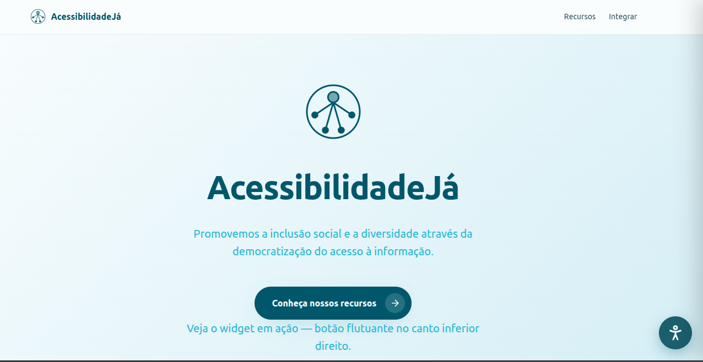

# Acessibilidade Já

**Código da Disciplina**: FGA0208 
**Número do Grupo**: 04 
**Entrega**: 04 

## Equipe

<table>
  <tr>
  <td align="center"><a href="https://github.com/Felipe-Brandim"> <b>Felipe Brandim</b></a> 
  <td align="center"><a href="https://github.com/daramariabs"> <b>Dara Maria</b></a> 
  <td align="center"><a href="https://github.com/pfc15"> <b>Pedro Cruz</b></a> 
  <td align="center"><a href="https://github.com/Fernandavazgit1 "> <b>Fernanda Vaz</b></a> 
  <td align="center"><a href="https://github.com/mrodrigues14 "> <b>Matheus Rodrigues</b></a> 
  <td align="center"><a href="https://github.com/lucasbbranco"> <b>Lucas Branco</b></a> 
    <td align="center"><a href="https://github.com/enzo-fb"> <b>Enzo Fernandes</b></a> 
    <td align="center"><a href="https://github.com/fabiofonteles1 "> <b>Fábio Fonteles</b></a> 
    <td align="center"><a href="https://github.com/isaacbatista26 "> <b>Isaac Batista</b></a> 
  </tr>
</table>

## Sobre:

Queremos por meio desse projeto trazer uma solução open source para problemas de acessibilidade em aplicações web.

A intenção é criar widgets de acessibilidade que possam ser facilmente utilizados em sites diversos, ficando a critério do desenvolvedor a escolha da nossa ferramenta. Uma vez que ele a escolhe e a implementa no código, os usuários poderão usufruir livremente de seus benefícios;contribuindo dessa forma para um mundo digital um pouco mais acessível.

<!-- ## Exemplos da Terceira Entrega:

 Diagrama de Fachada:

  

Diagrama de Estratégia:

  

 -->

# Passo a passo para executar nossa aplicação:

- Para visualizar o pages localmente após clonar o repositório e entrar na pasta, o comando é:

`mkdocs serve`

- **Pra ver nossos testes todos passando, primeiro é necessário estar com o servidor web rodando!**

Para iniciar o servidor web é muito simples, basta já ter feito o `npm install` uma vez e será seguro dar o `npm run dev`, com o servidor de pé, basta digitar `npm run test`e o jest será chamado para realizar as baterias de teste.

Essas baterias são importantes para ver a demonstração de alguns padrões escolhidos.

## Demonstração do Widget funcionando:

Nessa versão do projeto foi adicionado uma demonstração ainda em aperfeiçoamento, mas bem interessante de como nossa ferramenta irá funcionar na prática.

Para visualizar basta entrar na pasta `projetocomgofs` e dentro dela rodar os seguintes comandos:

1. `npm install`
2. `npm run dev`
3. acessar o `http://localhost:5173/`.

## Licença

Este projeto é **open source** e está licenciado sob a **Licença MIT**.

## Histórico de versões

| Versão | Data       | Descrição         | Autor(es)                                           |
| :----: | :--------- | :---------------- | :-------------------------------------------------- |
| `1.0`  | 15/06/2026 | Criação da página | [Felipe Brandim](https://github.com/Felipe-Brandim) |
